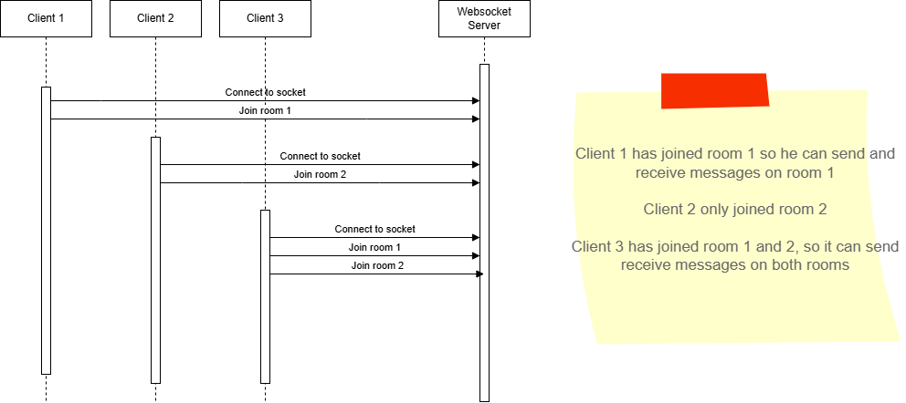

# Web Sockets NestJS & Angular ngx-socket.io
This is a sample project to demonstrate how to use websockets to work with rooms.

This project aims to show how to create a Websocket server that can
* Broadcast message to clients in a room
* Broadcast messages to clients in a room omiting the sender
* Broadcast message to clients on a room from an event handled on the server Eg Http request, messaging...



## Flow
A Client needs to connect to the websocket first, following by connecting to a room
```typescript
    this.socketService.connect();

    const response: RoomAcknowledge = await this.socketService
        .joinRoom({resourceId: this._roomId().toString()});
    
    // service making the call
    public async joinRoom(data: Room): Promise<RoomAcknowledge> {
        return this._roomAction('join-room', data);
}
```

Once the client is connected, then it can publish messages to the `message` websocket 
and it will be forwarded to the correct room based on the resourceId and it will reply on the `message-reply` socket
```typescript
    @SubscribeMessage('message')
    public listenForMessages(
      @ConnectedSocket() client: Socket,
      @MessageBody() message: Room,
    ): void {
      if (message.resourceId) {    
      // Only send the message to clients watching this resource
      const roomName = `resource:${message.resourceId}`;
      if (message.omitSender) {
        client.to(roomName).emit('message-reply', message);
      } else {
        this._server.to(roomName).emit('message-reply', message);
      }
      // this._logger.log(`Message sent for resource ${message.resourceId}`);
        } else {
          // If no resourceId is specified, notify only the sender
          client.emit('error', {
            message: 'No resourceId specified in the message',
          });
        }
    }
```

The message itself has details about the client, the type and its message content
```typescript
    export interface Message {
      id: string;
      clientId: string;
      feature: string;
      subFeature: string;
      resourceId: string;
      messageType: string;
      message: string;
      omitSender: boolean;
      timestamp: Date;
    }

```

The server will keep track of all the clients connect to each room and will destroy the room as it needs


